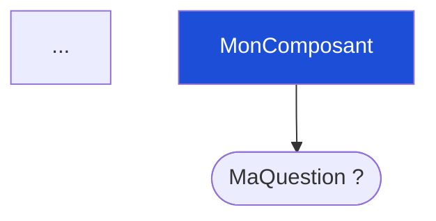

# Krystal

Plugin Obsidian pour travailler en collaboration avec un agent IA sur un projet de code. Krystal maintient un **langage commun** entre ta vue canvas (humaine) et les fichiers manipulés par l'agent (machine) via un fichier `CONTEXT.md` partagé et bidirectionnel.

> Desktop uniquement · Obsidian ≥ 1.0.0

---

## Vue d'ensemble

```
Canvas Obsidian  ←→  CONTEXT.md  ←→  Agent IA (Claude Code…)
      ↕                                        ↕
  Notes .md                              Code source
```

1. Tu crées et modifies ton schéma dans le canvas
2. Krystal génère `CONTEXT.md` (Mermaid + prose de chaque note)
3. L'agent lit, complète ou modifie le `CONTEXT.md`
4. Krystal importe les modifications dans tes notes vault
5. Krystal resynchronise le canvas depuis le Mermaid modifié

---

## Fonctionnalités

### Génération de contexte

**Commande :** `Krystal : Générer le contexte projet`  
**Bouton :** Icône dans le ruban latéral

Lit le canvas actif (ou celui configuré dans les settings) et écrit `CONTEXT.md` à la racine du projet avec :

- Un **diagramme Mermaid** de l'architecture complète, coloré par catégorie de kind
- Une section par note `.md` avec sa prose, ses relations et son bloc structuré
- Des **sous-contextes** dans des sous-dossiers pour chaque groupe canvas et chaque canvas imbriqué
- Des liens Markdown entre contexte principal et sous-contextes

#### Structure générée

```
projet/
├── CONTEXT.md          ← contexte principal
└── CONTEXT/
    ├── MonGroupe.md    ← sous-contexte du groupe "MonGroupe"
    └── MonSousCanvas.md
```

#### Format d'un bloc note dans CONTEXT.md

```markdown
### MaNote <!-- vault:Notes/MaNote.md -->
**Source :** [src/ma-note.ts](vscode://file/…)
**Relations :** → **AutreNote** · ← **TroisiemeNote**

Corps de la note (prose modifiable par l'agent)

<!-- kind-block -->
interface MaNote {
  field1: string;  // Description
}
<!-- /kind-block -->
```

---

### Mermaid ↔ Canvas bidirectionnel

Le bloc Mermaid dans `CONTEXT.md` est la **source de vérité partagée**.

#### Canvas → Mermaid (automatique à la génération)

Chaque nœud canvas reçoit son ID verbatim comme identifiant Mermaid, plus une classe CSS correspondant à son kind :



#### Mermaid → Canvas

**Commande :** `Krystal : Synchroniser canvas depuis Mermaid (CONTEXT.md)`

L'agent peut modifier le Mermaid dans `CONTEXT.md` (ajouter des nœuds, des liens, changer des labels). Cette commande :

- Détecte les nœuds présents dans le Mermaid mais absents du canvas → les **crée** avec un placement automatique (tri topologique)
- Met à jour les labels des nœuds existants si modifiés
- Ajoute les arêtes manquantes
- Ne supprime jamais de nœuds canvas automatiquement

---

### Import bidirectionnel notes ↔ CONTEXT.md

**Commande :** `Krystal : Synchroniser depuis CONTEXT.md`

Après que l'agent a modifié `CONTEXT.md`, importe les changements dans les notes vault :

- **Frontmatter** et **titre** des notes : toujours préservés
- **Blocs `<!-- kind-block -->`** : régénérés depuis le frontmatter, jamais importés
- **Prose** écrite par l'agent : importée dans le corps de la note

#### Sections protégées — `:::lock`

Entoure une partie d'une note avec `:::lock` pour la protéger de l'import :

```markdown
:::lock
Ce texte a été validé manuellement.
Il ne sera jamais écrasé par l'agent.
:::
```

Si l'agent déplace ou supprime un bloc `:::lock` dans `CONTEXT.md`, la version vault est restaurée lors de l'import.

#### Notes gelées — frontmatter `frozen: true`

```yaml
---
kind: component
frozen: true
---
```

Une note avec `frozen: true` est incluse en lecture seule dans `CONTEXT.md` (marquée `<!-- vault:path frozen:true -->`). L'import l'ignore entièrement.

#### Sections plan — `plan: true`

Les notes avec un kind de type Plan (voir ci-dessous) reçoivent le marqueur `<!-- vault:path plan:true -->` dans le header de section — signal pour l'agent que ce territoire est géré par l'utilisateur.

---

### Système de kinds

Chaque note peut avoir un `kind` dans son frontmatter. Les kinds sont divisés en deux **catégories** :

#### Kinds Plan — territoire utilisateur

| Kind | Forme Mermaid | Description |
|---|---|---|
| `epic` | `(( ))` double cercle | Objectif de haut niveau avec critères d'acceptance |
| `task` | `[ ]` rectangle | Tâche actionnable avec statut et responsable |
| `milestone` | `([ ])` stade | Livrable ou point de contrôle daté |
| `decision` | `{ }` losange | Décision architecturale avec contexte et options |
| `question` | `[ ?]` rectangle | Question ouverte à résoudre |
| `spec` | `[/ /]` parallélogramme | Spécification technique détaillée |

#### Kinds Code — territoire IA

| Kind | Forme Mermaid | Description |
|---|---|---|
| `component` | `[ ]` rectangle | Module, classe ou système autonome |
| `interface` | `{{ }}` hexagone | Structure de données ou contrat |
| `type` | `[/ /]` parallélogramme | Alias de type ou union |
| `enum` | `{ }` losange | Ensemble de valeurs nommées |
| `config` | `[( )]` cylindre | Paramètres exposés ou options |
| `media` | `[/ \]` trapèze | Asset média (image, vidéo, audio…) |
| `file` | `[ ]` rectangle | Référence de fichier générique |

Chaque kind code génère un **bloc structuré** depuis le frontmatter de la note :

- `interface` → bloc TypeScript avec la liste des champs
- `type` → alias de type TypeScript
- `enum` → bloc TypeScript avec les valeurs
- `config` → tableau Markdown paramètre / type / défaut / description
- `media` → format et dimensions

---

### Création de notes typées

**Palette de commandes :** `Krystal : Nouvelle fiche · <Kind>`  
Disponible pour les 13 kinds (6 Plan + 7 Code).

Chaque commande ouvre une modale qui demande le **nom** et le **dossier** de destination, puis crée la note avec un template prérempli adapté au kind.

**Exemples de templates :**

```yaml
# task
---
kind: task
status: todo
assignee: ""
---
## MaTache
Description de la tâche.
### Checklist
- [ ] Étape 1
```

```yaml
# decision
---
kind: decision
status: open
options:
  - Option A
  - Option B
---
## MaDecision
### Contexte
### Décision retenue
```

---

### Définir / changer le kind d'une note existante

**Clic droit** sur une note `.md` → `Krystal : Définir le kind`

Ouvre une modale listant tous les kinds (Plan et Code séparés) avec leur description. Modifie ou ajoute le champ `kind:` dans le frontmatter sans toucher au reste de la note.

---

### Ouvrir dans VS Code

**Clic droit** sur un fichier dans l'explorateur → `Ouvrir dans VS Code`

Si la note a un champ `file: src/mon-fichier.ts` dans son frontmatter, ouvre directement ce fichier source dans VS Code. Sinon, ouvre le dossier du projet.

---

## Configuration

**Paramètres :** Réglages Obsidian → Krystal

| Paramètre | Défaut | Description |
|---|---|---|
| Canvas principal | _(vide)_ | Canvas utilisé en fallback si aucun n'est ouvert |
| Chemin du projet | `../` | Chemin relatif vault → racine du projet |
| Fichier de sortie | `CONTEXT.md` | Nom du fichier généré |

---

## Commandes disponibles

| Commande | Description |
|---|---|
| `Krystal : Générer le contexte projet` | Génère CONTEXT.md depuis le canvas actif |
| `Krystal : Synchroniser depuis CONTEXT.md` | Importe les modifications de l'agent dans les notes vault |
| `Krystal : Synchroniser canvas depuis Mermaid` | Reporte les modifications Mermaid dans le canvas Obsidian |
| `Krystal : Nouvelle fiche · <Kind>` | Crée une note typée (×13 commandes) |

---

## Workflow typique

```
1. Tu dessines l'architecture dans le canvas Obsidian
   (notes .md + groupes + liens)

2. Génère → CONTEXT.md
   Le Mermaid et les sections sont prêts pour l'agent.

3. Tu demandes à l'agent de compléter / améliorer
   "Ajoute un composant AuthService relié à UserStore.
    Rédige la spécification de l'interface Token."

4. L'agent modifie CONTEXT.md
   → ajoute des nœuds au Mermaid
   → complète les sections prose

5. Synchronise canvas depuis Mermaid
   → les nouveaux nœuds apparaissent dans le canvas

6. Synchronise depuis CONTEXT.md
   → les notes vault sont mises à jour

7. Tu révises dans le canvas, ajustes, protèges
   ce qui doit l'être avec :::lock ou frozen: true

8. Retour à l'étape 2
```
